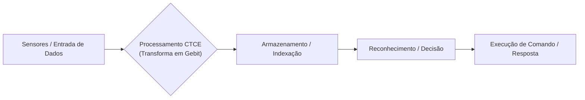
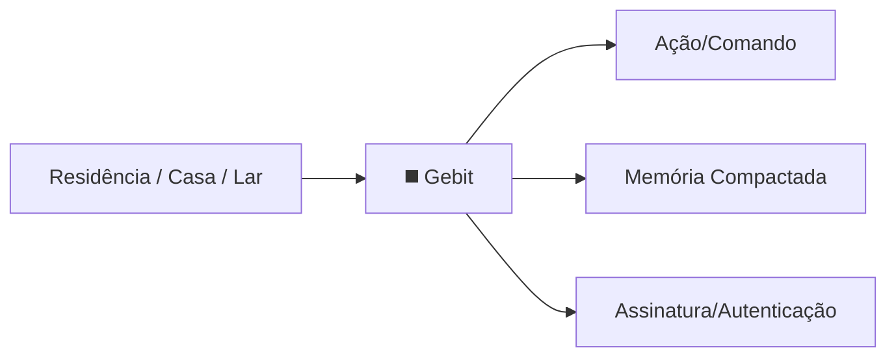

# Litografia Abstrata na CTCE: Um Guia para Programadores

---

## O que é Litografia Abstrata?

A litografia abstrata é um método de **compactação simbólica/topológica** onde conceitos, comandos e memórias são representados por padrões topológicos únicos (Gebits), semelhantes a hashes, tokens ou identificadores únicos — mas no domínio físico, não digital.

**Resumo:**  
> Assim como um hash representa um arquivo inteiro em poucos bytes, um Gebit condensa ideias, comandos ou sequências completas em um único padrão físico, eficiente e seguro.

---

## Analogia para Devs

**| Palavra | Bytes | Gebit (Padrão Topológico) |**  
|---|---|---|  
| "Residência" | 10 | ◼️ |  
| "Casa" | 4 | ◼️ |  
| "Lar" | 3 | ◼️ |  

- Todos os exemplos acima podem ser condensados no mesmo símbolo físico (Gebit), otimizando espaço, processamento e reconhecimento.
- Pequenas variações no padrão funcionam como diferentes “assinaturas digitais” (caligrafia → identidade/contexto).

---

## Funcionamento em Fluxo

- **Entrada:** Sinais, comandos, ideias.
- **Processamento:** Transformação em padrão topológico (Gebit = token/hash físico).
- **Armazenamento:** Indexação eficiente como “chave primária” em DBs.
- **Reconhecimento:** Decisão associativa e instantânea baseada no padrão.
- **Execução:** Ação rápida, segura e contextual.

---

## Por que isso é poderoso?

- **Eficiência:** Menos espaço, mais velocidade.
- **Identidade:** Cada Gebit pode ser único (autenticação, rastreabilidade).
- **Contexto/Nuance:** Variações permitem nuances sem perder o significado central.
- **Criptografia:** Padrão topológico = chave de segurança nativa.
- **Riqueza associativa:** Como índices em bancos de dados, mas para ideias/sensações/comandos.

---

## Aplicações Práticas

- **IA e Machine Learning:** Raciocínio associativo, aprendizado e compressão semântica.
- **Robótica / Controle Autônomo:** Sequências de ações e rotinas mapeadas em Gebits para decisões rápidas.
- **Autenticação Segura:** Assinaturas topológicas exclusivas para usuários, dispositivos ou ações.
- **Interfaces neurais:** Comunicação direta, compressão sensorial, privacidade embutida.
- **Sistemas distribuídos:** Indexação, compressão e autenticação ultra-eficiente.

---

## Exemplo Prático

Imagine um robô autônomo que precisa decidir entre múltiplos comandos:

- Recebe comandos naturais: “Vá para casa”, “Vá para sua residência”, “Volte ao lar”.
- Todos são convertidos para o mesmo Gebit topológico.
- O sistema reconhece o padrão, identifica nuances (quem enviou, contexto) e executa a ação.
- Memórias de trajetos, sensações de obstáculos ou rotinas de navegação também são “compactadas” em Gebits, otimizando o armazenamento e a consulta.

---

## Resumo Visual

---

## Potencial Futuro

- Um “alfabeto topológico” para máquinas, permitindo compressão e comunicação de qualquer conceito.
- Aprendizado adaptativo: o sistema aprende novos padrões e otimiza a própria linguagem interna.
- Segurança, privacidade e eficiência nativas, com potencial para transformar IA, robótica e interfaces homem-máquina.

---

### Para saber mais

- Consulte a documentação oficial do projeto.
- Veja exemplos de código, simulações e repositórios abertos.

---

*Conceito original: Bear-urso | Documento estruturado por Copilot GitHub*